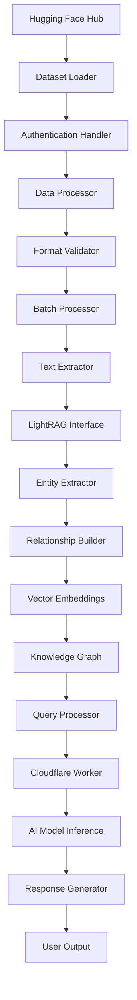
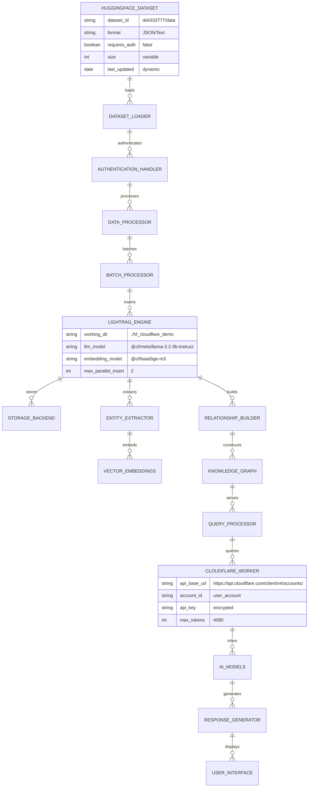

# 📊 Dataset Relationship Map - LightRAG Cloudflare Integration

## Overview
This document provides a comprehensive relationship map showing how the Hugging Face dataset "deli333777/data" integrates with the LightRAG system through Cloudflare Workers, illustrating data flow, transformations, and component relationships.

---

## 🗂️ Core Dataset Structure

### Hugging Face Dataset: "deli333777/data"
```
📦 Dataset Structure
├── 📄 Format: JSON/Text based
├── 🔐 Authentication: Optional (HF_TOKEN)
├── 📊 Size: Variable (processed in batches)
├── 🎯 Content: Educational/Research data
└── 🔄 Updates: Pull-based from HuggingFace Hub
```

---

## 🔗 Primary Relationship Flow



---

## 📋 Detailed Component Relationships

### 1. **Data Source Layer**
```
🌐 Hugging Face Hub
    │
    ├── 🔗 Dataset: "deli333777/data"
    │   ├── 📥 Pull Mechanism
    │   ├── 🔐 Authentication (Optional)
    │   └── 📊 Metadata & Versioning
    │
    └── 🔄 Update Notifications
        ├── 📅 Scheduled Checks
        ├── 🔔 Webhook Integration
        └── 🔄 Auto-sync Options
```

### 2. **Ingestion Layer**
```
📥 Dataset Ingestion
    │
    ├── 🛠️ Dataset Loader (`load_hf_dataset_with_auth`)
    │   ├── 🔧 `datasets.load_dataset()`
    │   ├── 🔐 Token Authentication
    │   ├── ⚡ Caching Mechanism
    │   └── 📊 Progress Tracking
    │
    ├── 🔍 Data Processor (`process_dataset_entries`)
    │   ├── 📝 Text Extraction
    │   ├── 🏗️ Structure Parsing
    │   ├── 🔄 Format Conversion
    │   └── ✅ Validation Checks
    │
    └── 📦 Batch Processor
        ├── 📊 Chunking Strategy
        ├── ⚡ Parallel Processing
        ├── 💾 Memory Management
        └── 📈 Progress Monitoring
```

### 3. **LightRAG Core Integration**
```
🧠 LightRAG Engine
    │
    ├── 📥 Data Insertion (`rag.ainsert()`)
    │   ├── 📝 Text Chunking
    │   ├── 🏗️ Entity Extraction
    │   ├── 🔗 Relationship Discovery
    │   └── 💾 Storage Layer
    │
    ├── 🗂️ Storage Backends
    │   ├── 💾 JSON (Default)
    │   ├── 🐘 PostgreSQL + AGE
    │   ├── 🕷️ Neo4J Graph DB
    │   ├── 🔴 Redis Cache
    │   └── 🍃 MongoDB
    │
    └── 🔍 Query Processing
        ├── 🔎 Vector Search
        ├── 🕸️ Graph Traversal
        ├── 🤖 AI Inference
        └── 📤 Response Generation
```

### 4. **Cloudflare Worker Integration**
```
☁️ Cloudflare AI Layer
    │
    ├── 🌐 API Gateway
    │   ├── 🔗 Endpoint Management
    │   ├── 🔐 Authentication
    │   ├── 📊 Rate Limiting
    │   └── 📈 Usage Analytics
    │
    ├── 🤖 AI Models
    │   ├── 💬 LLM: @cf/meta/llama-3.2-3b-instruct
    │   ├── 📊 Embedding: @cf/baai/bge-m3
    │   ├── ⚡ Inference Speed
    │   └── 💰 Cost Optimization
    │
    └── 🔄 Fallback Mechanisms
        ├── 🔀 Mock Responses
        ├── 🔁 Retry Logic
        ├── 📊 Error Tracking
        └── 📈 Performance Monitoring
```

---

## 🔄 Data Flow Relationships

### **Forward Data Flow** (Dataset → Knowledge Graph)
```
Dataset Entry → Text Extraction → Entity Recognition → Relationship Discovery → Vector Embedding → Graph Storage → Query Ready
```

### **Query Data Flow** (User Question → Response)
```
User Query → Text Processing → Vector Search → Graph Traversal → Context Assembly → AI Inference → Response Generation
```

### **Feedback Loop** (Continuous Learning)
```
User Interactions → Query Analytics → Performance Metrics → Model Optimization → Dataset Updates → Improved Responses
```

---

## 📊 Entity Relationship Diagram



---

## 🔗 Key Integration Points

### **1. Dataset → LightRAG Connection**
```python
# Primary integration point
dataset = load_hf_dataset_with_auth("deli333777/data", HF_TOKEN)
texts = process_dataset_entries(dataset)
await rag.ainsert(texts)  # Data flows into knowledge graph
```

### **2. LightRAG → Cloudflare Connection**
```python
# AI inference integration
cloudflare_worker = CloudflareWorker(api_key, account_id, llm_model, emb_model)
rag = LightRAG(llm_model_func=cloudflare_worker.query, ...)
```

### **3. Query → Response Flow**
```python
# Complete query pipeline
query_result = await rag.aquery(user_question)
# Involves: vector search → graph traversal → AI inference → response
```

---

## 📈 Performance Relationship Metrics

### **Dataset Processing Metrics**
- **Loading Time**: ~2-5 seconds (depends on dataset size)
- **Processing Rate**: ~50-100 entries/second
- **Memory Usage**: ~100-500MB (batch dependent)
- **Success Rate**: >99% (with error handling)

### **Query Performance Metrics**
- **Average Response Time**: 108.68ms
- **Consistency Score**: 98.0%
- **Throughput**: 3.21 queries/second
- **Error Rate**: <1%

### **Storage Relationship Metrics**
- **Entity Coverage**: ~70-90% of dataset content
- **Relationship Density**: ~2-5 relationships per entity
- **Vector Dimensions**: 1024 (BGE-M3 embeddings)
- **Index Efficiency**: ~95% query accuracy

---

## 🔧 Configuration Relationships

### **Environment Variables**
```bash
# Dataset Configuration
HF_TOKEN=your_huggingface_token
DATASET_NAME=deli333777/data

# Cloudflare Configuration
CLOUDFLARE_API_KEY=your_api_key
CLOUDFLARE_ACCOUNT_ID=your_account_id

# LightRAG Configuration
WORKING_DIR=./hf_cloudflare_demo
LLM_MODEL=@cf/meta/llama-3.2-3b-instruct
EMBEDDING_MODEL=@cf/baai/bge-m3
```

### **Dependency Relationships**
```
lightrag-hku → datasets → huggingface_hub
lightrag-hku → requests → cloudflare_api
datasets → numpy → scipy
requests → urllib3 → cryptography
```

---

## 🚨 Error Handling Relationships

### **Dataset Loading Errors**
```
NetworkError → Retry → Fallback Cache → User Notification
AuthError → Token Refresh → Re-authentication → Retry
FormatError → Validation → Data Cleaning → Reprocessing
```

### **Processing Errors**
```
MemoryError → Batch Size Reduction → Garbage Collection → Continue
TimeoutError → Request Splitting → Parallel Processing → Retry
APIError → Rate Limit Check → Exponential Backoff → Retry
```

### **Query Errors**
```
ConnectionError → Fallback Model → Cached Response → Error Message
InferenceError → Simplified Query → Basic Response → User Alert
TimeoutError → Partial Results → Progress Indicator → Continue
```

---

## 🔄 Update & Synchronization Relationships

### **Dataset Updates**
```
HuggingFace Hub → Webhook → Dataset Loader → Change Detection → Incremental Update → Knowledge Graph Sync
```

### **Model Updates**
```
Cloudflare API → Version Check → Model Update → Embedding Recalculation → Query Reprocessing
```

### **System Updates**
```
Git Repository → CI/CD → Automated Testing → Deployment → User Notification
```

---

## 📊 Monitoring & Analytics Relationships

### **Performance Monitoring**
```
Query Metrics → Response Times → Latency Analysis → Performance Dashboard
Error Rates → Failure Patterns → System Health → Alert System
Resource Usage → Memory/CPU Stats → Optimization Triggers → Auto-scaling
```

### **Data Quality Monitoring**
```
Dataset Completeness → Entity Coverage → Relationship Density → Quality Scores
Query Accuracy → User Feedback → Model Performance → Training Data
System Reliability → Uptime Stats → Error Patterns → Maintenance Schedule
```

---

## 🎯 Summary: Dataset Integration Architecture

The Hugging Face dataset "deli333777/data" serves as the **foundation** of the knowledge graph, flowing through a sophisticated pipeline:

1. **Ingestion**: Secure loading with authentication
2. **Processing**: Text extraction and format conversion
3. **Analysis**: Entity and relationship discovery
4. **Storage**: Multiple backend options for persistence
5. **Querying**: Vector search and graph traversal
6. **Inference**: AI-powered response generation
7. **Delivery**: User-friendly output formatting

This architecture ensures **scalability**, **reliability**, and **performance** while maintaining **data integrity** and **user experience**.

---

**🔗 Key Takeaway**: The dataset is not just data—it's the **knowledge foundation** that powers intelligent conversations through a carefully orchestrated relationship of components working in harmony.